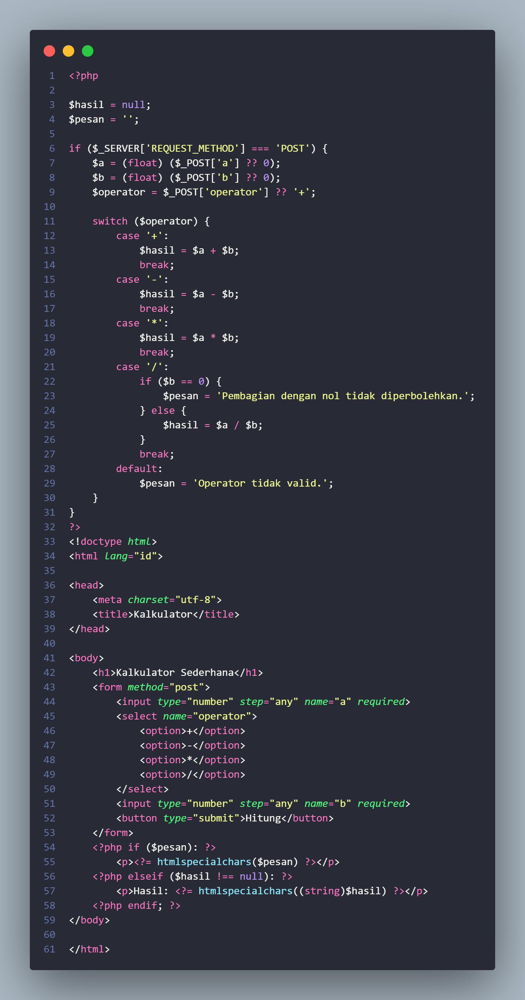
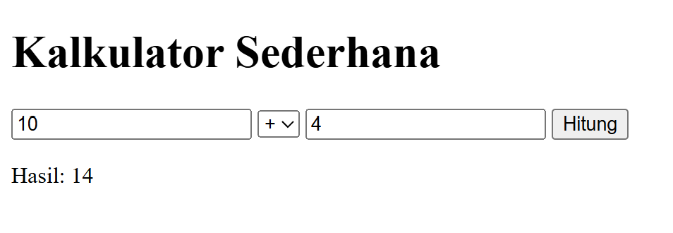
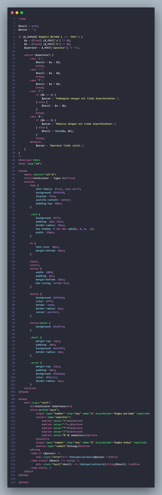
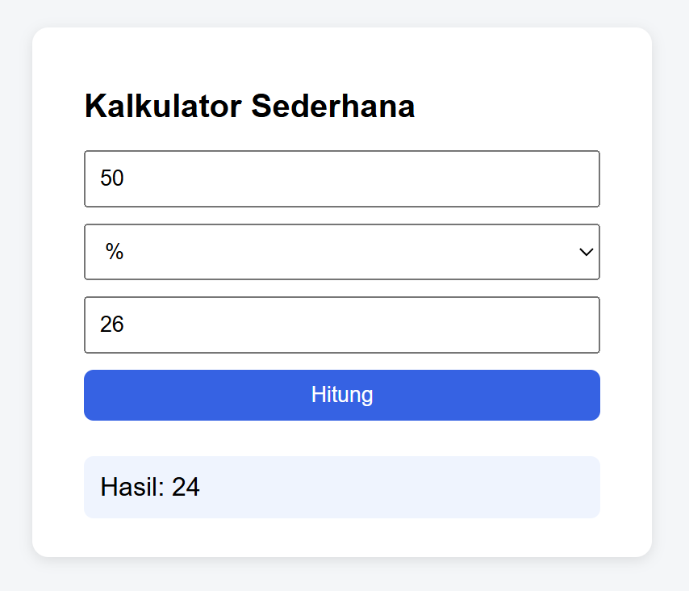

## 📌 Tugas 1 — Pertemuan 1 (Kalkulator)
Nama: Az-Zahra Putri

NPM: 4524210018

Mata Kuliah: Prak. Pemrograman Berbasis Web

---
### 1. Menjalankan Contoh Pertemuan 1
Seluruh contoh pada Pertemuan 1 (`kalkulator.php` dan `biodata.php`) telah dijalankan menggunakan XAMPP (Apache + PHP) melalui `localhost` dan menghasilkan output tanpa error.
 
### 2. Modifikasi yang Dilakukan
File modifikasi: `pertemuan-1/Tugas1.php` (berbasis `kalkulator.php`)
 
1. **Menambahkan operator baru (modulus `%`)** kalkulator sekarang bisa menghitung sisa bagi dua angka, menggunakan fungsi `fmod()` agar tetap akurat untuk angka desimal.
2. **Menambahkan styling CSS + validasi tampilan** tampilan kalkulator dipercantik dengan card, warna, dan pesan error/hasil yang dibedakan warnanya (merah untuk error, biru untuk hasil).
### 3. Penjelasan 5 Bagian Kode Terpenting
 
| No | Bagian Kode | Penjelasan |
|----|-------------|------------|
| 1 | `$_SERVER['REQUEST_METHOD'] === 'POST'` | Mengecek apakah form sudah dikirim (POST) atau halaman baru dibuka pertama kali (GET), agar kalkulasi hanya berjalan setelah submit. |
| 2 | `(float) ($_POST['a'] ?? 0)` | Mengubah input teks dari form menjadi angka, dengan `??` (null coalescing) untuk mencegah error jika field belum terisi. |
| 3 | `switch ($operator) { case '%': ... }` | Struktur percabangan yang memilih operasi matematika sesuai pilihan user; operator `%` (modulus) ditambahkan di sini sebagai modifikasi. |
| 4 | `if ($b == 0) { ... }` | Validasi untuk mencegah error *division/modulus by zero* sebelum operasi dijalankan. |
| 5 | `htmlspecialchars((string)$hasil)` | Membersihkan output sebelum dicetak ke HTML agar aman dari karakter berbahaya (proteksi dasar XSS). |
 
### 4. Screenshot Sebelum & Sesudah Modifikasi
 
**Sebelum:**

 
**Sesudah:**

 
### 5. Error yang Pernah Muncul
 
- **Error:** Hasil modulus untuk angka desimal tidak sesuai harapan (misalnya `7.5 % 2` menghasilkan nilai yang salah/terpotong).
- **Penyebab:** Awalnya menggunakan operator modulus bawaan PHP (`%`), yang hanya bekerja dengan tipe integer sehingga bagian desimal terpotong (implicit cast ke int).
- **Perbaikan:** Mengganti perhitungan modulus dengan fungsi `fmod($a, $b)`, yang mendukung angka pecahan (float) sehingga hasilnya akurat.