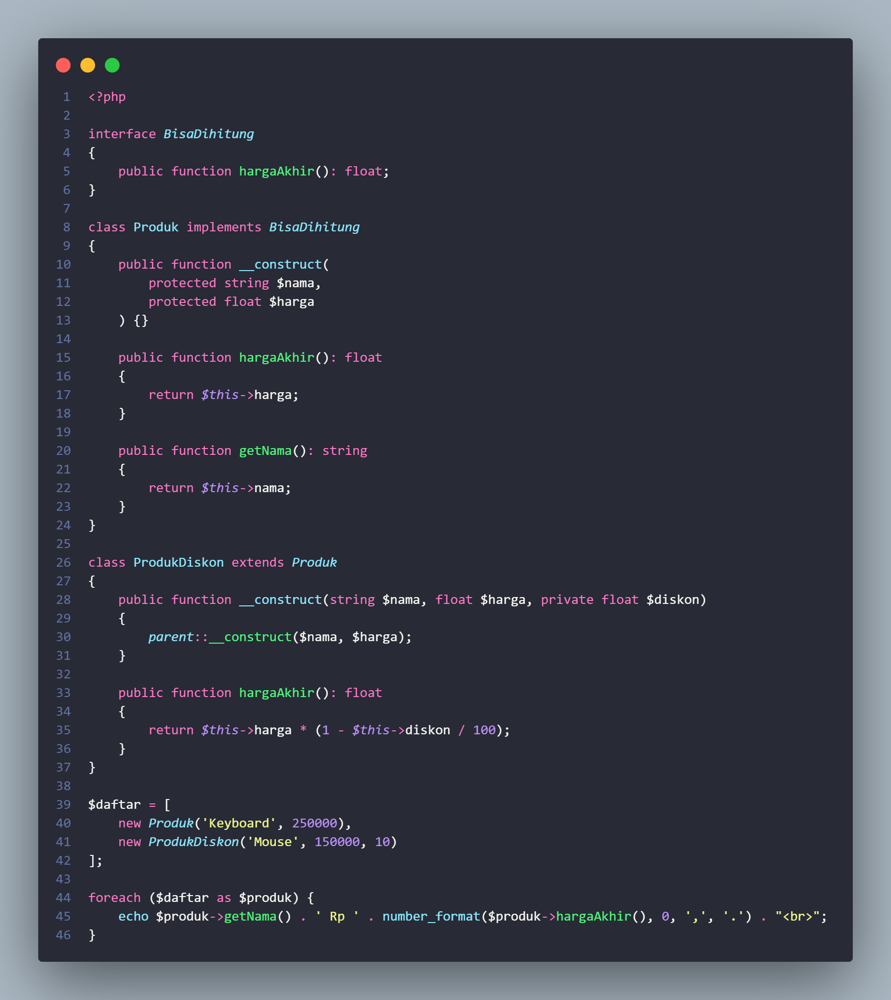
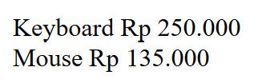
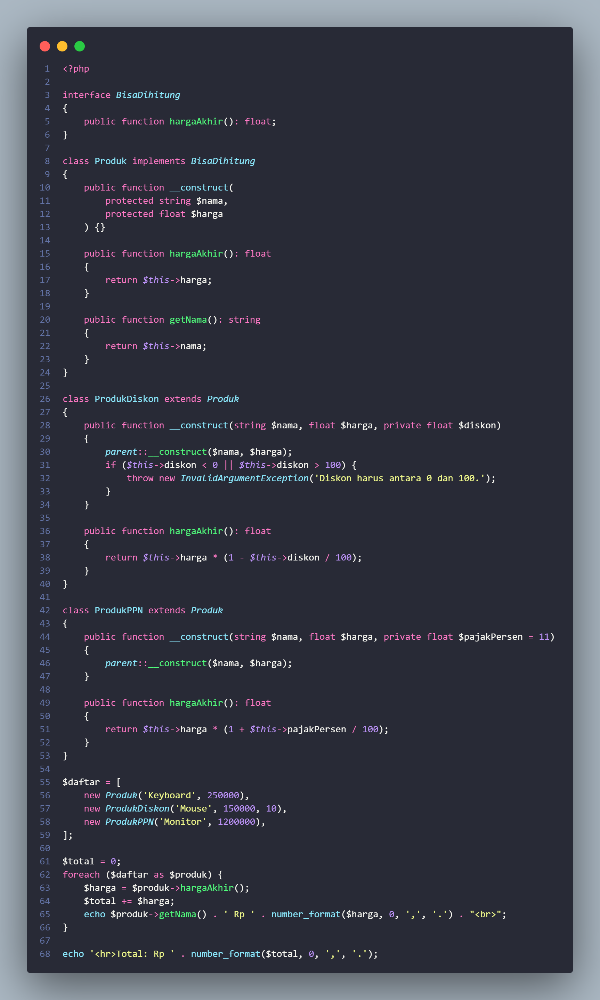
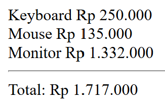

## 📌 Tugas 2 — Pertemuan 2 (Hitung)
Nama: Az-Zahra Putri

NPM: 4524210018

Mata Kuliah: Prak. Pemrograman Berbasis Web

---
### 1. Menjalankan Contoh Pertemuan 2
Seluruh contoh pada Pertemuan 2 (`identitas.php` dan `hitung.php`) telah dijalankan menggunakan XAMPP (Apache + PHP) melalui `localhost` dan menghasilkan output tanpa error.
 
### 2. Modifikasi yang Dilakukan
File modifikasi: `pertemuan-2/Tugas2.php` (berbasis `hitung.php`)
 
1. **Menambahkan class baru `ProdukPPN`** turunan dari `Produk` yang menghitung harga akhir dengan tambahan pajak (PPN 11%), menunjukkan penerapan inheritance dan polimorfisme.
2. **Menambahkan validasi diskon (0–100) dan total keseluruhan** `ProdukDiskon` sekarang menolak nilai diskon yang tidak valid (`InvalidArgumentException`), dan program menampilkan total harga dari seluruh produk.
### 3. Penjelasan 5 Bagian Kode Terpenting
 
| No | Bagian Kode | Penjelasan |
|----|-------------|------------|
| 1 | `interface BisaDihitung { public function hargaAkhir(): float; }` | Mendefinisikan kontrak method yang wajib dimiliki setiap jenis produk (biasa, diskon, PPN), sekalipun rumus perhitungannya berbeda-beda. |
| 2 | `public function __construct(protected string $nama, protected float $harga)` | Constructor property promotion mendeklarasikan sekaligus mengisi properti langsung dari parameter, tanpa menulis `$this->nama = $nama;` manual. |
| 3 | `class ProdukDiskon extends Produk` | Penerapan inheritance: `ProdukDiskon` dan `ProdukPPN` mewarisi properti/method dari `Produk` dan hanya perlu meng-override `hargaAkhir()` sesuai rumus masing-masing. |
| 4 | `if ($this->diskon < 0 \|\| $this->diskon > 100) { throw new InvalidArgumentException(...); }` | Validasi data agar objek `ProdukDiskon` tidak pernah memiliki nilai diskon yang tidak masuk akal. |
| 5 | `foreach ($daftar as $produk) { $produk->hargaAkhir(); }` | Contoh polimorfisme baris kode pemanggilnya sama persis, tapi PHP otomatis menjalankan versi `hargaAkhir()` sesuai tipe objek aslinya. |
 
### 4. Screenshot Sebelum & Sesudah Modifikasi
 
**Sebelum:**

 
**Sesudah:**

 
### 5. Error yang Pernah Muncul
 
- **Error:** `Fatal error: Uncaught InvalidArgumentException: Diskon harus antara 0 dan 100`
- **Penyebab:** Saat menguji program, objek `ProdukDiskon` sempat dibuat dengan nilai diskon di luar rentang wajar (misalnya diisi `150`), yang seharusnya memang ditolak oleh validasi baru.
- **Perbaikan:** Mengganti nilai diskon dengan angka yang valid (0–100) saat membuat objek `ProdukDiskon`, sekaligus membuktikan bahwa validasi yang ditambahkan sudah bekerja sesuai tujuan (mencegah data tidak valid).