## 📌 Tugas 3 — Pertemuan 3 (Database `akademik`)

Nama: Az-Zahra Putri

NPM: 4524210018

Mata Kuliah: Prak. Pemrograman Berbasis Web

--- 
### 1. Menjalankan Contoh Pertemuan 3
File `akademik.sql` (berisi tabel `mahasiswa` dan `prodi`, lengkap dengan relasi foreign key) telah diimpor ke phpMyAdmin/MySQL melalui XAMPP dan berhasil dijalankan tanpa error kritis.
 
 
### 2. Modifikasi yang Dilakukan
1. **Field baru** — menambahkan kolom `email` pada tabel `mahasiswa`.
2. **Kondisi baru** — menambahkan kolom `status` (ENUM: `aktif`, `cuti`, `lulus`) dengan default `aktif`.
3. **Validasi** — menambahkan constraint `UNIQUE` pada kolom `email` agar tidak ada mahasiswa dengan email yang sama.
4. **Query baru (INSERT)** — menambahkan 2 data mahasiswa baru.
5. **Query baru (SELECT + JOIN)** — menampilkan data mahasiswa beserta nama program studi, diurutkan dari IPK tertinggi.

### 3. Penjelasan 5 Bagian Kode Terpenting
| No | Bagian Kode | Penjelasan |
|----|-------------|------------|
| 1 | `ALTER TABLE mahasiswa ADD COLUMN email ...` | Mengubah struktur tabel yang sudah ada tanpa perlu membuat ulang tabel atau kehilangan data yang sudah tersimpan. |
| 2 | `status ENUM('aktif','cuti','lulus') NOT NULL DEFAULT 'aktif'` | Membatasi nilai kolom hanya pada pilihan tertentu (mencegah data sampah) dan otomatis mengisi nilai default jika tidak disebutkan saat insert. |
| 3 | `ADD CONSTRAINT uq_mahasiswa_email UNIQUE (email)` | Validasi di level database: mencegah dua baris memiliki nilai email yang sama, tanpa perlu dicek manual di aplikasi. |
| 4 | `JOIN prodi p ON m.id_prodi = p.id_prodi` | Menggabungkan data dari dua tabel berbeda berdasarkan relasi foreign key, sehingga nama program studi bisa ditampilkan bersama data mahasiswa. |
| 5 | `UPDATE mahasiswa SET ipk = 3.90 WHERE nim = '230001'` | Klausa `WHERE` memastikan perubahan hanya terjadi pada baris yang dimaksud — tanpa `WHERE`, seluruh baris di tabel akan ikut berubah. |
 
### 4. Screenshot Sebelum & Sesudah Modifikasi
#### Modifikasi 1: Menambahkan kolom email pada tabel mahasiswa
**Sebelum:**
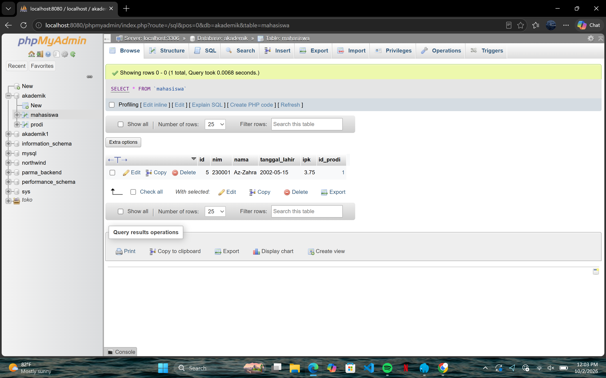
 
**Sesudah:**
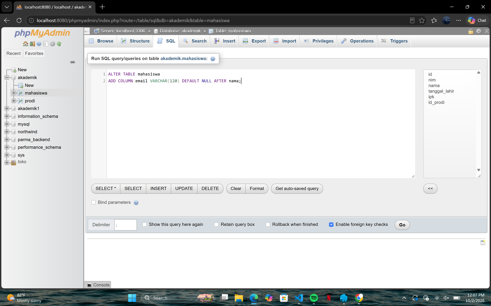
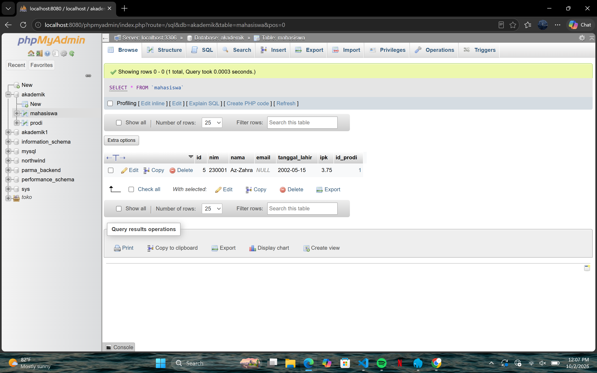

#### Modifikasi 2: Menambahkan kolom status 
**Sebelum:**

 
**Sesudah:**
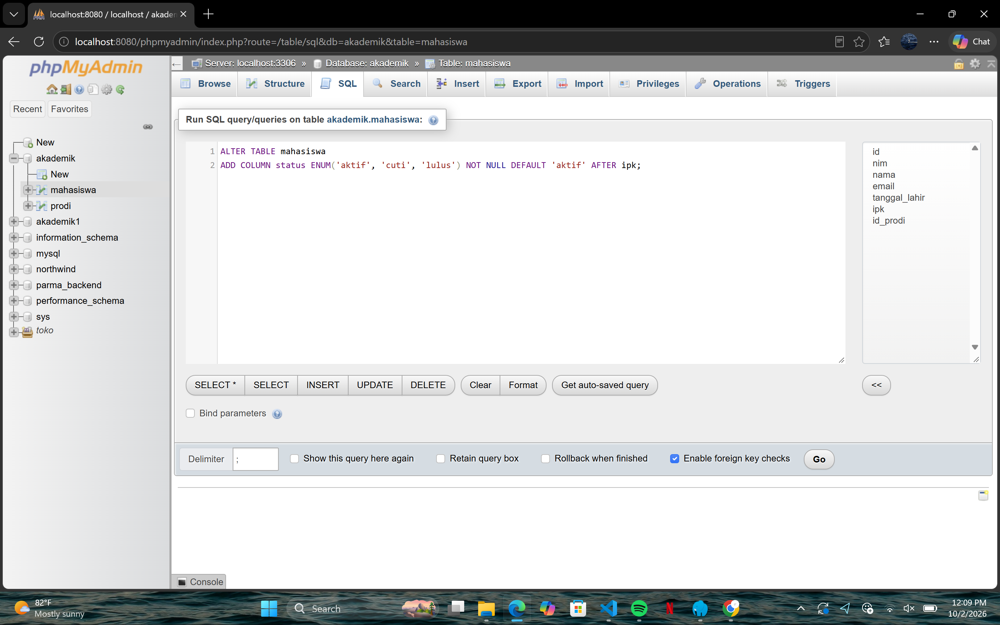


#### Modifikasi 3: Menambahkan constraint UNIQUE pada kolom email
**Sebelum:**
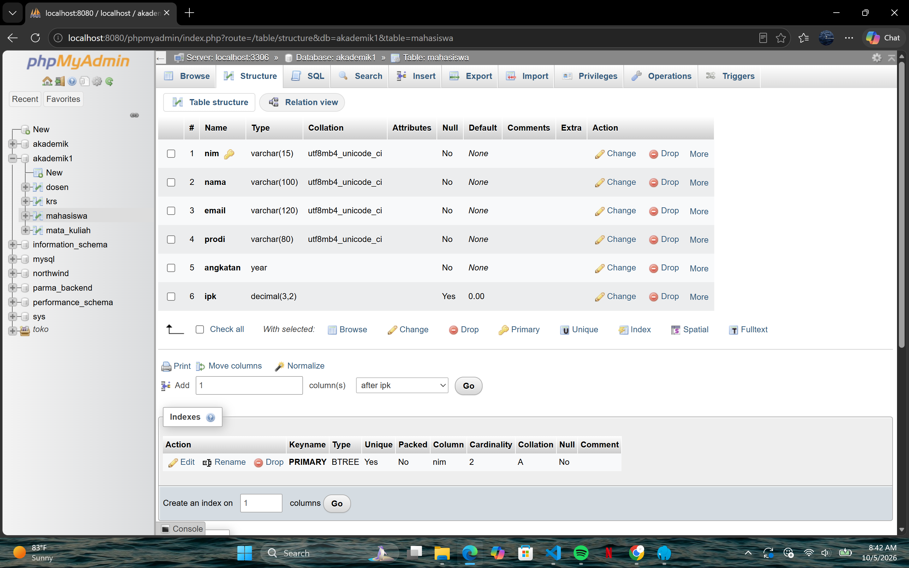
 
**Sesudah:**
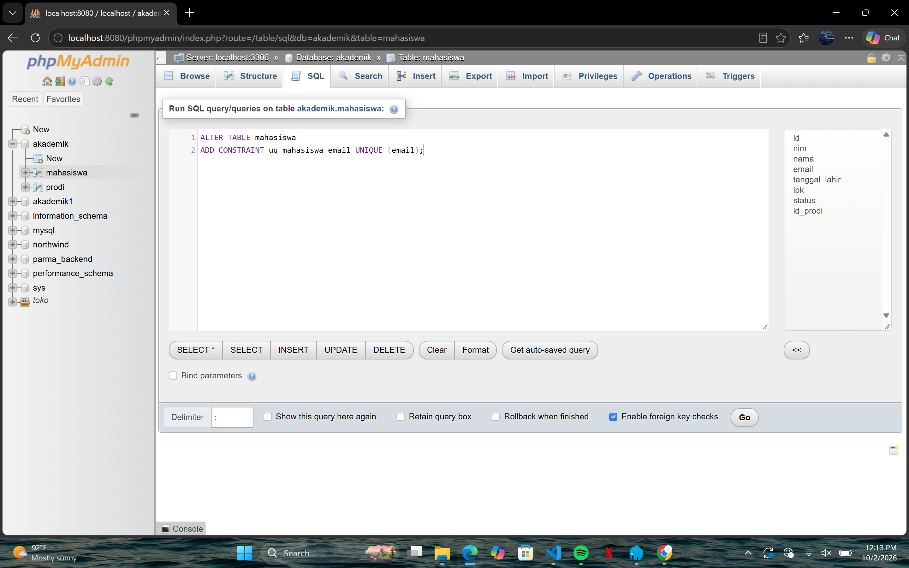
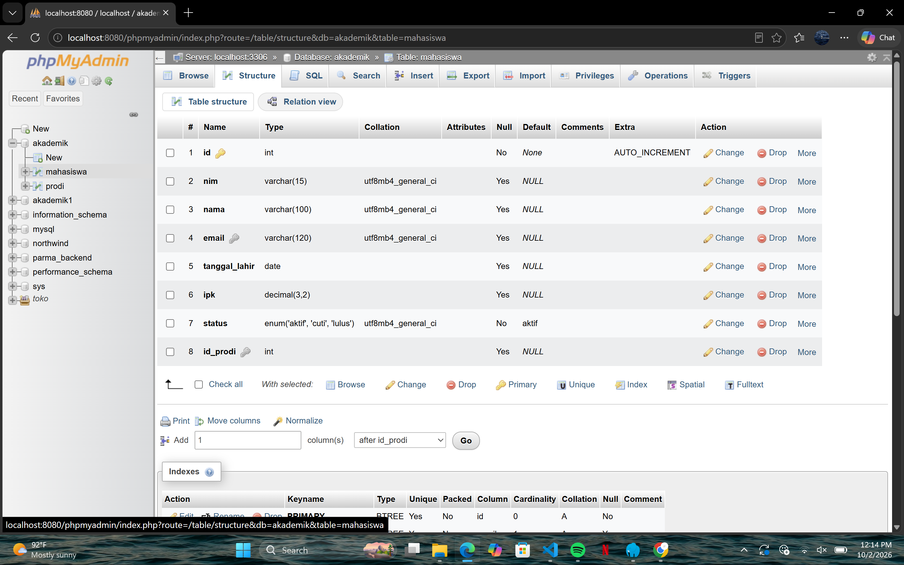

#### Modifikasi 4: Menambahkan 2 data mahasiswa baru
**Sebelum:**
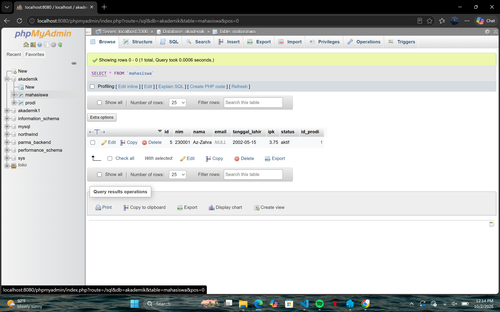
 
**Sesudah:**
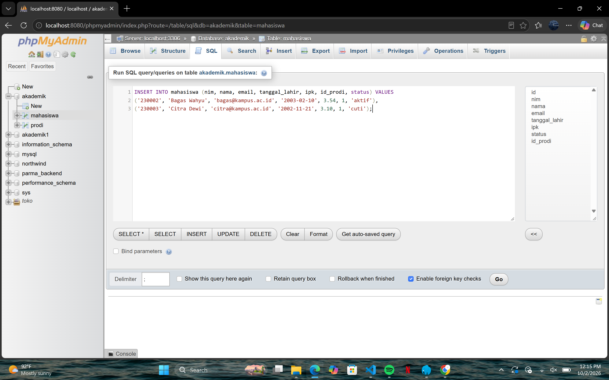
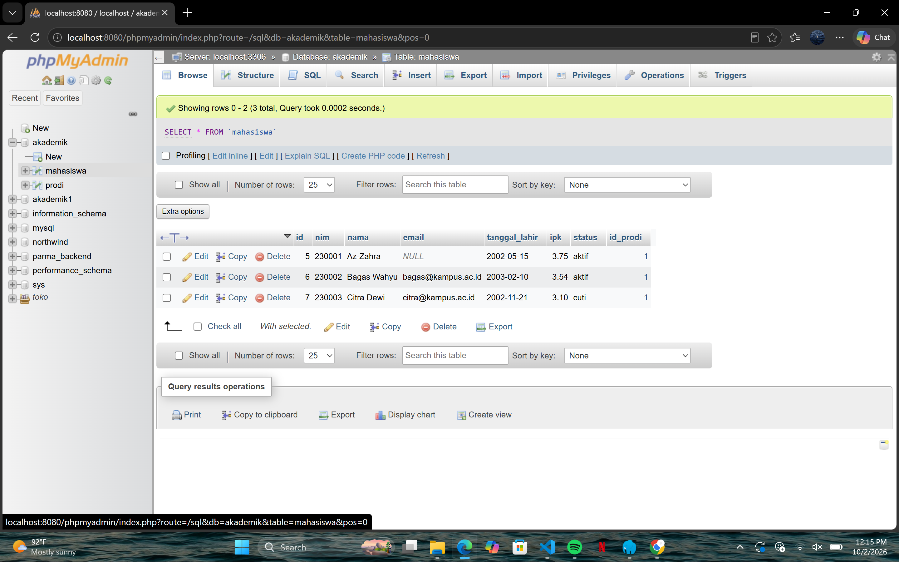

#### Modifikasi 5 : Menampilkan data mahasiswa beserta nama program studi, diurutkan dari IPK tertinggi
**Sebelum:**

 
**Sesudah:**

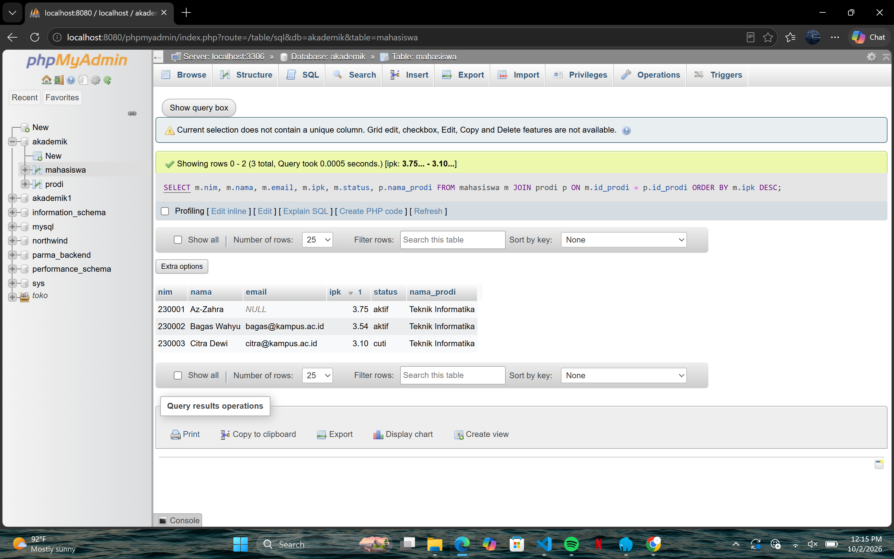
 
### 5. Error yang Pernah Muncul
- **Error:**
```
  ERROR 1062 (23000): Duplicate entry 'bagas@kampus.ac.id' for key 'email'
```
- **Penyebab:** Query `INSERT` pada `akademik.sql` dijalankan dua kali pada database yang sama. Karena kolom `email` sudah diberi constraint `UNIQUE` (modifikasi #3), MySQL menolak baris baru yang nilainya sama dengan data yang sudah ada.
- **Perbaikan:** Sebelum menjalankan ulang `akademik.sql`, pastikan tabel `mahasiswa` dikosongkan dulu (`TRUNCATE TABLE mahasiswa;` lalu import ulang data awal), atau gunakan nilai email yang berbeda setiap kali insert. Ini juga membuktikan bahwa constraint validasi yang ditambahkan sudah bekerja sesuai tujuannya (mencegah data duplikat).