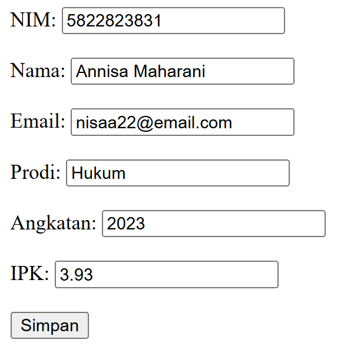
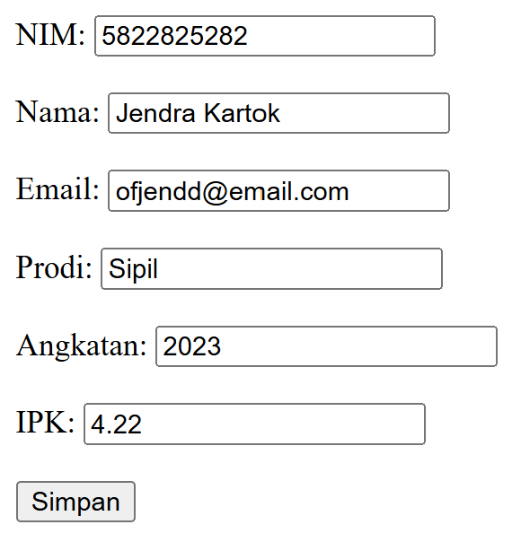
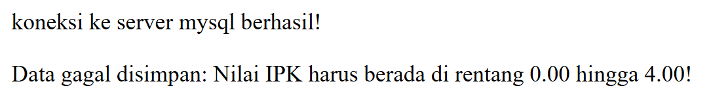
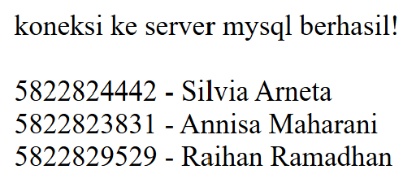
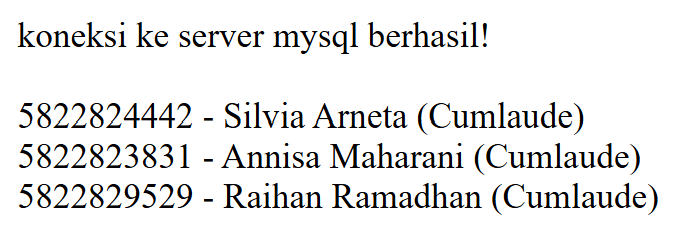

## 📌 Tugas 5 — Pertemuan 5 (Database `akademik2`)

Nama: Az-Zahra Putri

NPM: 4524210018

Mata Kuliah: Prak. Pemrograman Berbasis Web

--- 
### 1. Menjalankan Contoh Pertemuan 5
Aplikasi web berbasis PHP diintegrasikan dengan database `akademik2` melalui server lokal Laragon. Alur eksekusi dilakukan via browser melalui URL `http://localhost:8080/...` dengan urutan: `form.php` (input data) ➡️ `simpan.php` (proses simpan ke database) ➡️ `data.php` (menampilkan data dari database).

### 2. Modifikasi yang Dilakukan
1. **Field & Validasi Baru** — Menambahkan pembatasan input IPK (`min="0.00"`, `max="4.00"`, `step="0.01"`) pada `form.php` dan validasi sisi server pada `simpan.php`.
2. **Kondisi Baru (Predikat IPK)** — Menambahkan logika pengkondisian (`if-else`) pada `data.php` untuk menampilkan status predikat kelulusan berdasarkan nilai IPK (misal: IPK ≥ 3.50 menampilkan predikat "Cumlaude").

### 3. Penjelasan 5 Bagian Kode Terpenting
| No | Bagian Kode | Penjelasan |
|----|-------------|------------|
| 1 | `include "koneksi.php";` | Mengimpor file konfigurasi koneksi database sehingga variabel `$koneksi` dapat digunakan untuk mengeksekusi query SQL pada file terkait. |
| 2 | `mysqli_connect($host, $user, $pass, $db);` | Membuka koneksi baru ke server MySQL menggunakan kredensial host, username, password, dan nama database target (`akademik2`). |
| 3 | `$_POST['nim']`, `$_POST['nama']`, dll. | Mengambil data input yang dikirimkan oleh pengguna melalui metode HTTP POST pada `form.php` untuk diproses lebih lanjut. |
| 4 | `mysqli_query($koneksi, $query);` | Menjalankan instruksi/query SQL (seperti `INSERT` atau `SELECT`) pada database `akademik2` yang sedang terhubung. |
| 5 | `while ($data = mysqli_fetch_assoc($query))` | Melakukan iterasi perulangan untuk menguraikan setiap baris hasil query `SELECT` menjadi array asosiatif hingga seluruh data ditampilkan. |

### 4. Screenshot Sebelum & Sesudah Modifikasi

#### Modifikasi 1 : Validasi Input IPK (Form & Server Side)
**Sebelum:**




**Sesudah:**




#### Modifikasi 2 : Menambahkan Logika Predikat Kelulusan IPK pada Tampilan Data
**Sebelum:**



**Sesudah:**



### 5. Error yang Pernah Muncul
- **Error:**
```text
  MySQL shutdown unexpectedly
```
- **Penyebab:** Terjadi bentrok port 3306 serta log korup pada lingkungan XAMPP saat dijalankan bersamaan dengan Laragon
- **Perbaikan:** Memindahkan lokasi repository project dari htdocs XAMPP ke folder www Laragon (C:\laragon\www\), dan menjalankan aplikasi langsung dari browser via server lokal Laragon (http://localhost:8080/...).